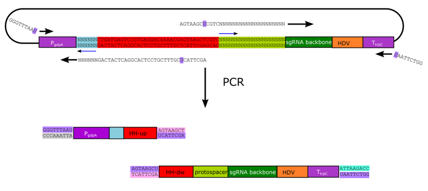
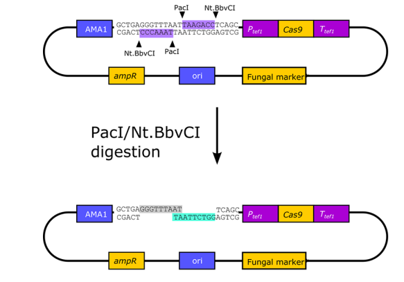
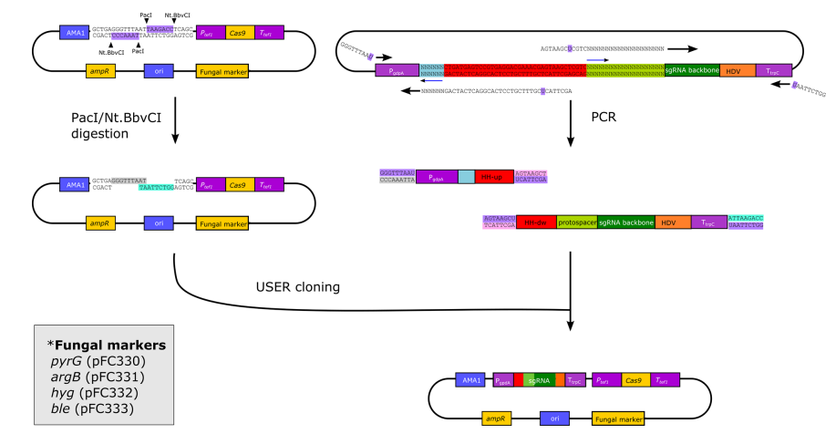
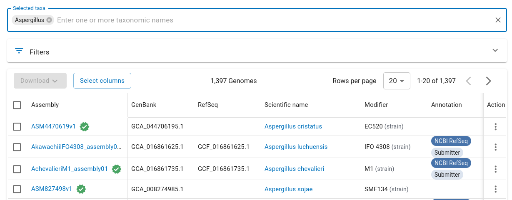

# BioE 134 Final Project Submission

## Project Overview

This project expands on the work from our Homework 1: CRISPR assignment to provide additional utilities in **Python** to design CRISPR constructs for filamentous fungi. In particular, it provides an end-to-end workflow where a user may input a gene to knock out and receive as output a construction file with the sequence of steps required to use CRISPR to knock out that gene. To narrow the scope of the project, I focused specifically on _Aspergillus_ and the protocol outlined by Nødvig et al. in "A CRISPR-Cas9 System for Genetic Engineering of Filamentous Fungi" (PLOS ONE, 2015). 

---

## Scientific Background

Successful gene knockout using CRISPR-Cas9 in _Aspergillus_ involves a few additional elements that do not come into play for a simpler organism like _E. coli_:
- **For the Cas9 gene**: Because _Aspergillus_ is eukaryotic, its genome is organized into chromosomes and stored in a nucleus. Along with codon optimizing the _S. pyogenes_ Cas9 gene for fungi, Nødvig and coauthors attached an NLS (nuclear localization signal) so that the protein is delivered to the nucleus of the fungal cell. To ensure high expression levels, they also added the promoter and terminator for the _tef1_ gene. (The _tef1_ promoter is a well-characterized constitutive promoter frequently used in genetic engineering of _Aspergillus_.)
- **For the sgRNA sequence**:In eukaryotes, mRNA transcribed by RNA polymerase II typically have a 5' cap and poly-A tail. Becasue CRISPR sgRNAs don't have a cap and tail, in other eukaryotes, they are transcribed from genes that have RNA polymerase III promoters. RNA polymerase III promoters are poorly understood in _Aspergillus_, so the authors instead put the CRISPR sgRNA into a transcript that uses RNA polymerase II and added self-cleaving ribozymes before and after the sgRNA: hammerhead (HH) at the 5' end and hepatitis delta virus (HDV) at the 3' end. These self-cleaving ribozymes will allow the sgRNA transcript to "pop out" of the larger transcript it is a part of in the nucleus. To ensure high expression levels of the sgRNA, the authors added another, different constitutive promoter (gdpA) before the sgRNA sequence/ribozyme sequences, and the trpC terminator after.

A plasmid with the Cas9 gene and sgRNA (protospacer + trcrRNA scaffold sequence) can be produced from existing plasmids in three steps as Nødvig and coauthors describe:

**Step 1:** Use PCR with plasmid pFC334 to add in custom protospacer sequence



The [plasmid pFC334](https://www.addgene.org/87846/) as sold by Addgene contains a protospacer designed to knock out the yA gene, which gives spores their characteristic green color. In order to replace the protospacer with a different sequence, the forward primer for the second fragment has its first 12 bases match the end of the hamerhead ribozyme (with a uracil residue substituted in so USER enzyme can be used in Step 2), and its last 20 bases are the new protospacer sequence. This will yield two fragments which together contain the promoter, ribozymes, and sgRNA scaffold from the original plasmid with the new protospacer. 

**Step 2:** Use USER enzyme (endonuclease VIII and uracil DNA glycosylase) to create sticky ends on PCR fragments

In order to expose the "sticky ends" of the PCR fragments from Step 1, they are digested with the USER enzyme (endonuclease VIII, abbreviated "Nei" along with uracil DNA glycosylase, abbreviated "UDG"), which removes the substituted uracil residue and leaves an overhang.

**Step 3:** Use PacI/Nt.BbvCI enzymes to create sticky ends in plasmid pFC330-333



The [plasmid pFC330]() as sold by Addgene contains the Cas9 gene, as well as pyrG (a selectable marker) and the AMA-1 gene, which is naturally found in _Aspergillus nidulans_ and allows for autonomous plasmid replications. In order to expose the "sticky ends" of this plasmid to insert the fragments from Step 1 and Step 2, the USER casette in pFC330 is digested with restriction enzymes PacI and Nt.BbvCI. 

**Step 4:** Use USER fusion to combine three fragments with their sticky ends



In the final step, all three sets of corresponding "sticky ends" come together to create a single plasmid containing the Cas9 gene, the protospacer, and the sgRNA scaffold. This plasmid can be introduced into _Aspergillus_ (via _Agrobacterium_-mediated transformation, RNP, or another method) to knock out a desired gene. 

---

## Scope of Work

I developed new functions organized into several files: 

- In `genbank_functions.py`, I added functions to retrieve and interface with GenBank files:
    - `get_genbank_file()` to retrieve a GenBank file for a genome via FTP given NCBI RefSeq ID and assembly name
    - `extract_genes_info()` to extract gene information for an organism's genome as a dictionary given a path to a GenBank file
    - `gene_id_to_seq()` to retrieve a gene sequence from a gene information dictionary given a standard NCBI Gene ID
    - `plasmid_gb_to_seq()` to retrieve the gene sequence of a plasmid given the path to a GenBank file for that plasmid
- In `cf_functions.py`, I added functions to produce and view construction files:
    - `cf_shorthand()` to produce the shorthand string representation of a construction file given a ConstructionFile object
    - `generate_aspergillus_ko_cf()` to generate a ConstructionFile object that produces a plasmid to knock out a gene in _Aspergillus_ using the Nødvig protocol, given an appropriate protospacer that comes before a PAM in that gene
- In `crispr_functions.py`, I added some of the functions we implemented for Homework 1:
    - `find_PAM()`: locates index of _S. pyogenes_ PAM (protospacer-adjacent motif) sequence within target sequence matching pattern "NGG"
    - `find_protospacer()`: returns 20bp protospacer sequence preceding PAM in target sequence
 
I also added `PyDNA_CF_simulator` as a submodule. I did not use most of its functionality, but imported from `construction_file.py` and `polynucleotide.py` the definitions of `ConstructionFile`, the various steps a construction file can contain (`PCR`, `Digest`, etc.), and the different types of `Polynucleotide` (`dsDNA`, `plasmid`, `oligo`). 

---

## Testing

Some new functions have a limited set of unit tests implemented using **pytest**. These tests can be found in the `tests/` directory and run using the command `python -m pytest`.

---

## Usage Instructions

Clone the repository and install the required dependencies listed in `requirements.txt`.

```bash
pip install -r requirements.txt
```

Once installed, you can import and use individual functions as follows:

```python
from crispr_functions import find_PAM

# Example DNA sequence
dna_sequence = "ATGCAGTTCGACTACGGGACTACGACGATTATTAGACGACGATAGCGG"

# Find PAM sequence
find_PAM(dna_sequence)
```

The repository also contains an interactive script (`e2e.py`) that allows you to enter the name of a NCBI Ref Seq and Assembly name for a genome and Gene ID, and will print the resulting construction file. It can be run with the command `python e2e.py`. Genonome and assembly names can be located from the [NCBI website]([link](https://www.ncbi.nlm.nih.gov/home/genomes/)), as seen in the image below.



Running the script with the pre-programmed default values produces the following output:

```bash
Enter NCBI Ref Seq for desired genome (press enter to use default): 

Extracted genbank file named GCF_001890905.1_Aspac1.gb
First 5 genes in genome GenBank file:
Locus Tag: ASPACDRAFT_48858
Gene Name: None
UTR: CCAAGGTTCACCCAAACAGTATCCACCCAGGGAACAATAAATAGAATAAC
CDS: ATGTCCCCTGCCTTTCGCATTCAAGCTATCTCGATACCCAATAATTACTTGCCTCCACGCAAGTCGTTCACTCCTCTCCTATCCCCTCTCTCTCCCTCCCTCAGACTTTTCGGAAGATACTCACTGCATCGGCATTTGTTAGTGGAGCTAGGGGAATGGGAAGCTGCATACGAAAAGGCATCTGCTTTCGTAGCAGACCTAACCACTGCTCAAAAGGTAGCGCTTATTACAGGCAGTAGCGTCGAGTCAACCAAAGCCAACTTCACTGCATTTTACTTTCTTGATGGAGATATGGGCCTACAAGACTTTTACTATGTCTCCGCCTTCAGCTTATCGTCTGCGCTTGCCATGACCTGGGATCGCGATGCTATTTACTCGCAAGCCAAAGCTGTAGGGTCGGAATTCTACAACAAGGGCATCCAGGTTGTAGCTGGACCCACATCACAGCCCCTAGGACGCACTGTTTGGGGCGGCCGCAACGTTGAAGGCTTTGGTCCAGATCCTTATCTCAATGGATTGGCTATGGGTCTCACCACCAAGGCATACGTCGATGCCGGAGTCATTCCTGGCGGTAAACACTTCCTCCTTAATGAACAAGAAACCAACCGTTCTGCCAGTGATGCCACGGGGGCTCCTTATTCCTCCAATGCGGATGACAAGACTACTCATGAAATCTATCTCTGGCCCTTCTACGACGCTGTGAAAAATGGCCTCGGCGCTGTGATGTGCGCTATGACCAAGGTAAACGGGACGCTTGCCTGCGAAAACTCCGACCTTTTAATGAAGGCATTGAAAACCGAACTGGGATTTCCCGGGCTTGTCTGGCCTGATTTCGACGCTCAGAGCTCGGCCAGTGCTTCTGCTCTAGGTGGCGAGGACTATGGGTCAAGTACATACTGGAGTACATCTATTATCCAGAAACTTTTGTCGAACGGAACTCTTTCTGAGGCGCGCTTTAACGATATGGCTATCCGGAATTTGATGGCCTATTATTATGTGCGCTTGGATGATGGCCTGCAGCCAACTACCAGAACGACAGACACTTATATGGATGTTCGCGCCAATCACTCCAAGCTAATCCGTGAGAATGGAGCCAAGTCCATGGCTCTACTCAAAAATAAGAACGGTGCGCTACCACTGAAGAGCCCACATGTTATGGGAATCTTCGGTGCTCATGCTGGCAGTGTTATGGGTGGGCCCAATGGTGCAATCGATGTGGAAGGCTCTGGACCCACTTACCAAGGCCATCTGGTTACCGGCTCAGGATCTGGAAGGGGTTCAATCCCATACGTCGTGACACCGTTGCATGCTCTGACCGACAGAGCATCAAAAGATGGAACTATGCTGCGGTGGATCTTGAATGATACCTATACTAGTACTAACAGCTCTTCTCTAGTGGAGGCGAGCACGATATACACTAATGTGGAACCTTCTTACGCTAACTTTGCCACCGAATCTTCGGTTTGCCTTGTCTTTCTCAATGCTCTCGCCGGAGAAGGTGCTGATCGGATAGAGTTATATAACTCAAATCAGGATAGTATGGTCAATCAAGTTGCAGAAAATTGCAACAATACTATTGTCATCATCAATACTGTTGGGCCCCGACTGATGGATCAATGGATTGATCACGATAACGTTACTGCAGTTCTGTATGGTTCACTGCTTGGACAGGAATCGGGCAATTCTATCGTGGATATCCTTTACGGTGATGTCAACCCCTCCGCCCGCCTGATCCATACTATCGCCAAGAATGAGAGCGACTATAATGTCGGCATCTGTTATACCGCCCAATGCAATTTCACCGAGGGGGTCTACCTGGATTACCGCTACTTTGATAAGCACGATATTACCCCTAGATATCCTTTCGGGCATGGTCTGTCTTACACTACCTTTGACTACTCCGACCTCAAAGTCACGGCTCCCTCGTCAATTAGCAAGGCTCCTCTGGGCAAGAAGAGCGTTGGTGGTCCGAGTGATCTCTGGGACAATGTGGTCTCAGTTTCTGTCTTGATCACTAACAACGGGACCTTGGCCGGTGCAGAGGTGCCGCAGCTGTACATCGAATTTCCCGAGGCCGCTGACCAGCCAGTCCGGCAGCTTCGTGGGTTCGAACGGGTCGAGATTGATTCTGGCGGCCACTCGTACGTCATATTCGACCTTCGTCGCCGCGATCTCTCATATTGGGACGTCATGGCTCAGGAGTGGCTCGTCGCTCCCGGCTCATATAATGTCTTCATTGGCGCGAGCTCACGCGACCTAAGACTGAATGGAACGTTTTCTTTGACTGTTACAGCCTAA
Gene ID: 30975987
----------------------------------------
Locus Tag: ASPACDRAFT_37826
Gene Name: None
UTR: TTTGGCACGCAATTCCGTCCTGTCGCGAAAGCCGCACCGCAAATCACGGA
CDS: ATGGATTGCGACGAGACAAAGCCCGAGTGCTCGAACTGCGTCAACCATTCTGTGCGCTGTATCTACGATTCACCCGCGCCTAAAACAAAAAAGCCGGTGACCCTGCCTGCACAAACTCACAAGACAGAAAACAAAGTACAGGTCCAGTTCGTGGAATTCAATTTCCTCCATGTCCAACCAGCGCCCGCTCCCGTGCCCGCGACCCCCGCACCGGCAGACAACAAAACCCCCGCGTTGACCCTGTCACGTCCAACGGAGCCGGATTTCTGCTTGGAGGATTTCGAGCCCCAGCATTTTTATGTCTGCTCGACCGCCGCGAGCCTCACCGAAGATCCCGGAAGCGCTGAATTCTGGCAGACCCTGGTACCGCGCGCAAGCTTCTTATCACCGTTAGTCCATCACCTCATGCTGGCGCTGGCGTGTCTGCACATGACCCGGACTGCCCCCGTGCAAAATCGCGATGACAACGGCCGCTGCCTTGCCCGCTTTGAACACCACTATGCAACCGGCCTCCGGCTCTTAACGCGTGGGCTACCGGACATCTCGGTAGGAGGCGACGTCATTTGGATCGGGTCCATCCTGTTATGCTTCATCGGCCTGGCGCGCGGACCCCAGGCAAATGAGTTTTTGTTTTTCGATCGCGGCGCCGACGCCGGCCCTATCGAGTGGCTGGCGCTGCTGCACGGGGTCGATACGGTTTCTACCCTGCTAAGCAAAGGGCGAGCCTCTCCGGAGGACCAGCAGCAGCAACCCACCAAACCGTCTCCCACGCTGGGTAGTGGGTGCCGCCCTCCGCCCCGGGCTATCCCGCACACGATCACCCAGCAATTCCGGGAAAGCCTATCCCAAATCCGACAGTGGATCGAGAAGCAGTCTGCAGCAGCGGACCCCCTGCTCCCGACCTACCGGAACGCCATCGACCATACCCTCCAGGCATTTGCGTCTTTATGTCCCACCAGCGACGGCAATGCTGACCAAAACACCACCCCAGCTGCAGCTGCCAGTTCTGACAGAAAACCGTTCGGCTTCGTCCTGTTCACGTGGGTGACGCGCCTCGAGCAGCCGTTCTGGGAAGCTCTGCAGCGGAAACAGCCGGTGGCGTTGATGCTTGTGGCGCACTTCGCGGCGCTGATGCGGTGGATGGATGGGACGTGGGTCTCGGTTGGGTGGCCGGAGCATATTTTGCGCGGTGCGTGGATGTTTTTGGAGGAGGAGGAGCGGGGGTTGGTGAGATGGTTGATTGACGATGTCGGGGTGTTGGGGTTGTCTGGTTGA
Gene ID: 30974163
----------------------------------------
Locus Tag: ASPACDRAFT_37827
Gene Name: None
UTR: GTAGCAGCAGCAACGATAGCAGCGGCAGCCAAACGAGCGGCACGCACATC
CDS: ATGGTCCGGGGTATTATCTTCCAGCTCGTATTCGTGGGACTGGTCGTCGACTTCGTGCTGCGCCTGTCCAAAAGGGGCCGGCCGCAGGCCCTGTGGTCCAACCGGCCCCTGCTTTTGCTTGGTGGCGCGACCGCGCTCTCGCTGCTACTGATCTATATTCGGAGTGTGTACCGGACGATTGAGCTGCTACACGGATGGACGAGCTCGACGATGCATAACGAGATGTTGCTGATCGGGCTGGACGGCGCGATTATGGTCCCCGCCTTTTCGGTTTATAACCTGCTTCATCCGGGGTACCTGTTGCCGAAGGTACAGCGGGAGGTCGGGTACCTTGACGCTCGGGGGTTGCAGATGGAAATGGAGGCGGTTAAGGATGGTCGGTACCAGATAGTCGAGGTGGAGGGTGGAAAGGATGACTCTGTTACGTTGCTGGACAGGAGCTGA
Gene ID: 30974164
----------------------------------------
Locus Tag: ASPACDRAFT_55776
Gene Name: None
UTR: TCTGGGAAGAAGCACAACTTTCACTGCACTGTACTGTACCGTCAGTCAAC
CDS: ATGAGATACTTCGTTCTTGCCTGCGCCCCCCTTCTGTATGCGGTGACGCTCGCCTTCCCTCGCGCAGACTACGTAAGCGAGGGAAAGCTGCCTGCGGGCCATCCTCCGCTGGATTGGAAGCCCGCAGGCCTAGGAGACGCAAGGGCACCCTGCCCGATGCTCAACACCCTGGCAAACCACGGGTACCTGCCGCACGACGGGAAAGACATCACCAAGGCGCACACCATAGCCGCGCTGCACTCGGCGCTGAACATTGACCGAGAGCTGGCCCAGTATCTCTTCCAAGAGGCGCTGACGACCAACCCGGCCGCGAACGCCACAACTTTCTCGTTGAACGATCTGAGTCGCCACAATATCCTCGAGCATGATGCTAGTCTGAGCCGACTGGACTACTACTTCGGCGACAACCACGATTTCAACCAGGCGATCTTCGACCAGACGCGCCAGCACTGGCCCGACCCGATTATCACCGTGCAGGCCGCAGCCAACGCGCGCGAGGCCCGCGTGCGCACCTCCAACGCCACAAACCCGACCTTCACGCTGTCGGAGCTCGGGACTGCGTTCGGGTACGGCGAGACAGCGGCGTACATCATCATCCTGGGCAATAAGACCTCTGGGTTGGTGGACAGGTCGTGGGTGGAGTATTTGTTCGAGAACGAGCGTCTTCCGGTTGAGCTTGGCTGGACTAGACATGAGGAGGCGGTCTCGATGGACGATCTGGAAGGCATGATGCAGGAGGTGATAAATGCGACAGGGCATGCTGAGGAGGTCAAGAGAGAATTGGTTCGGCGGGGTGACTTGCACGTGGGACGGAGGGCCTGA
Gene ID: 30976866
----------------------------------------
Locus Tag: ASPACDRAFT_108718
Gene Name: None
UTR: CCCAACCTCTCCCCGCTCGACTTGGATTACACTCAGGTGGACAACAGAAC
CDS: ATGTCAATCTACACGACTATCGCAACCAGTAAGGAGCGTCACGCCGAAATCCAGGCCGCTCTCGCCGCCGTCGAGAGCAGCCCGGAAAGGCTCCAGTCGCACGAATCCTACCTCTCGGATCTCCGCCGCGCGCTGGCTGAGACTAACCAGCAGCTCGCACAGCTCCGACAGGTCACCCAGGTCGAGCGTGCGCTGCACGAGAAGTACCGCGACAGCACGGTGCGTCGCCTGCTCTACCGGGCGACGGGCAAGCGGACCGATTTCGAGGCCAAGGCCGATCAGGAGATGCGTGATTACTACGCCGCGCTGGCGAAGGAGAGCCGCGCACAGGCGCAGCAGGAGATGCTGGAGGCCCAGGTCGCGGATGCGGTGACGCAGGAGCGCGACCTTCAAGCCGCGTGCGTGGCGCGGGACCGACTGCAGGAGGAGCTCGACGCCATCTATAGCGAGATCTTCGAGGGCCGGACGGAGGATTTCCCGGAGGAGGATGCGCAGGAAGAGGTCACTCAGCTGGCGCGGCGGGAGTATGGGCAGCGGCGGCAGCGTTGGAGCGACGTCCACCAGGCGGCGCAGTGTCTGGCGAGAGGGCAGCTAACGATCCGGGAGGCGCTATTGAACCTAGTCGAGAGTCTGCGTCACTCGGAGAGGGATCTATGGGGGTTTGGAGGGACCCTGGTCGATGTGCGGCAGCAGAACTGTCTGTCCCGCGCGCAGCAGAAGGTCAGCCAGACGCAGATGCTGGCGGCACAAGCGAAACGGCTGGACTCGATGGTGCAGCCGCTACCGGCCATGAGTCTGGTCGAACGGGACTGGGTCGGGGGAATGCTCTTCGATACCTTCTTCTTCCACCTCGAGTTCTTGGATATGATGCAACAATCAGTTCTGGAGATCAAGCGAGCGGAGGAGAGCCTGGCCGCCGAAGTCCGGCGGATCAAGTCTCGGGAGGCAGACATGCAGGCGCAGCTGAATGAGGCGCGAACGACCTTCGAAAATGCACAGCAAGACCTTCGTCGGATTCGATACGAGGTATTCATGAAGACCGCTGACCCCCCACCGCCCTACACCGGTGCACCGACAGTGGGAAGTGTTTGA
Gene ID: 30969124
----------------------------------------
Locus Tag: ASPACDRAFT_37831
Gene Name: None
UTR: ATCACAGCTGGGCGATCAGCCCATGCGCTTCGTCTATGATGAAATCGGCA
CDS: ATGGGGTCCGGCGAGGGCTTGGTGCCCGTGAAGAAGTTGATCACGGCCTGCACGATCATGAGAAACGATGCCTACCACGGCGAGGACGGCCCCCAGAATGGGCATTGCCACGGCCATGGTCTCGATCACGGCCCAGAGCCCAATCTCGGACCCGACCTCGATGACATCCAGCACCACCGTCACTCCCTGGACGACGACGTTGAGCGCATTAGGCCCTTGCCAGGATCGGAGAACGAGTTCCAGTCATTGGCCATGGAGAACAACATGGTCACGATCAGGCCAATCCCCAGGAATGGCACAACCGCGCAGCAAATTCCCCGACCACTTGAACCGCTTCGCCGCCTCTTCGTAGCCGGGGGTACCTCTTTGGCGATGGCATCGATGTCTTCGTTCCAGGCTTCCTCGCTCTCGCTCGTTGTGGAGACTCCATCGGACGAAGTCCCATCTGGGATCAAGACCCGATAA
Gene ID: 30974165
----------------------------------------
Enter Gene ID for gene to knock out: 30974165

Protospacer sequence is: GCCCGTGAAGAAGTTGATCA

Generated the following construction file to knock out GeneID:30974165
Sequences:
pFC334         ACCAATGCTTAATCAGTGAGGCACCTATCTCAGCGATCTG...
pFC330-333     ACCAATGCTTAATCAGTGAGGCACCTATCTCAGCGATCTG...
frag1-fwd      GGGTTTAAU
frag1-rev      AGGCGGGACTACTCAGGCACTCCTGCTTTGCUCATTCGA
frag2-fwd      AGTAAGCUCGTCGCCCGTGAAGAAGTTGATCA
frag2-rev      UAATTCTGG

Steps:
pcr frag1-fwd frag1-rev pFC334 frag1
pcr frag2-fwd frag2-rev pFC334 frag2
digest frag1 ['UDG', 'Nei'] 1 frag1-sticky
digest frag2 ['UDG', 'Nei'] 1 frag2-sticky
digest pFC330-333 ['PacI', 'Nt.BbvCI'] 1 pFC330-dig
ligate ['frag1-sticky', 'frag2-sticky', 'pFC330-dig'] ko-plasmid
```
---

## Future Directions

While this code should operate correctly with well-formed input, it has not been thoroughly tested against a variety of error and edge cases and all functions would benefit from more robust input validation. Potential future directions for this work include prediction and minimization of off-target effects, implementing methods from other papers studying CRISPR-Cas9 in _Aspergillus_ species, and expanding the supported fungi beyond _Aspergillus_. Nødvig and coauthors also wrote a Perl script `OPTIMuS` to design protospacers able to target homologs of the same gene in different but closely related species, which could be integrated with the `find_protospacer()` function. 
